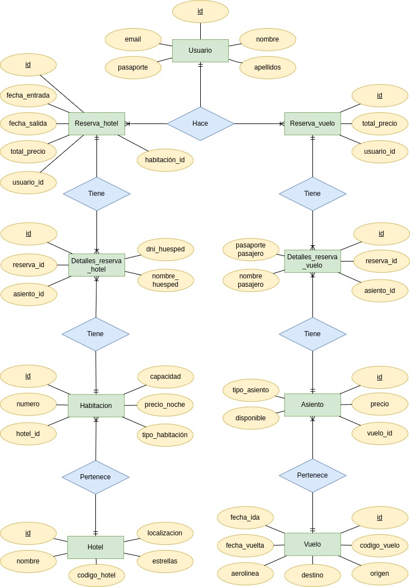

# Prueba técnica 4 - Agencia de turismo
GoTrip es una plataforma de turismo que permite a los usuarios buscar y reservar vuelos y hoteles de manera fácil y rápida. La aplicación ofrece una API REST desarrollada con Spring Boot para gestionar la información de vuelos, hoteles y reservas.

## **Tabla de Contenidos**
- [Requisitos Previos](#requisitos-previos)
- [Instalación y Configuración](#instalación-y-configuración)
- [API Endpoints](#api-endpoints)
- [Carga de Datos de Prueba](#carga-de-datos-de-prueba)
- [Modelo Entidad-Relación](#modelo-entidad-relación)
- [Versión en Vivo](#versión-en-vivo)

### **Requisitos Previos**
Para ejecutar GoTrip en tu entorno local, necesitas tener instalado:
- **Docker**
Con Docker instalado, puedes construir y ejecutar el proyecto sin necesidad de configurar nada más.
### **Instalación y Configuración**
1. **Clona el repositorio**:
```bash
git clone https://github.com/jose-016al/AlmironJose_pruebatec4.git
```
2. **Construir y ejecutar con Docker**:  
En el directorio raíz del proyecto, ejecuta los siguientes comandos para construir y ejecutar la aplicación en Docker:
```bash
docker-compose up --build
```
3. **Acceso a la API**:  
Una vez que Docker haya iniciado los contenedores, puedes acceder a la API en `http://localhost:8080`.
### **API Endpoints**
La documentación completa de la API está disponible en Swagger. Para acceder, abre el siguiente enlace después de haber iniciado el proyecto en Docker:

http://localhost:8080/swagger-ui.html

Además, en el repositorio encontrarás una colección de Postman para probar los endpoints fácilmente. Solo tienes que importar el archivo `GoTrip.postman_collection.json` a Postman.
### **Carga de Datos de Prueba**
Si deseas cargar datos de prueba en tu base de datos, puedes usar el archivo `go_trip.sql` incluido en el repositorio. Para hacerlo, sigue estos pasos:

1. **Eliminar la base de datos existente**  
Para evitar conflictos debido a tablas que ya existen, primero eliminaremos la base de datos y la recrearemos:
```bash
docker exec -it db mysql -u user -puser -e "DROP DATABASE go_trip; CREATE DATABASE go_trip;"
```
2. **Volcar el contenido del archivo `.sql`**  
A continuación, cargamos el archivo `go_trip.sql` en la base de datos. Ten en cuenta que este proceso puede tardar unos minutos dependiendo del tamaño del archivo:
```bash
docker exec -i db mysql -u user -puser go_trip < go_trip.sql
```
Con esto, la base de datos se poblará con los datos de prueba proporcionados.
### **Modelo Entidad-Relación**
A continuación, se muestra el modelo entidad-relación que representa la estructura de la base de datos del proyecto:  
 


### **Versión en Vivo**
Puedes probar la aplicación en vivo a través del siguiente enlace:

[Enlace a la aplicación en vivo](http://enlace-a-tu-aplicacion.com)

Esto te permitirá interactuar con los endpoints directamente y probar las funcionalidades de la plataforma GoTrip.